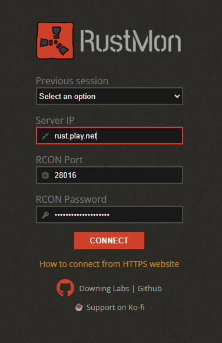
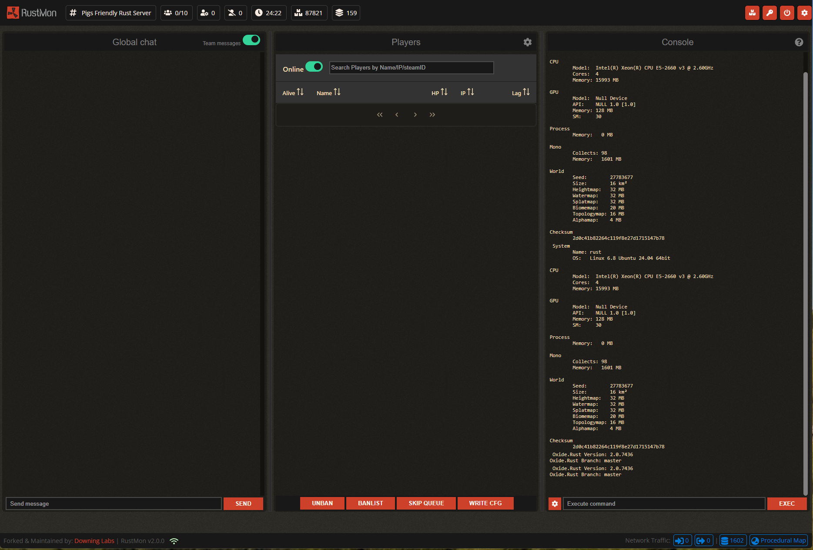
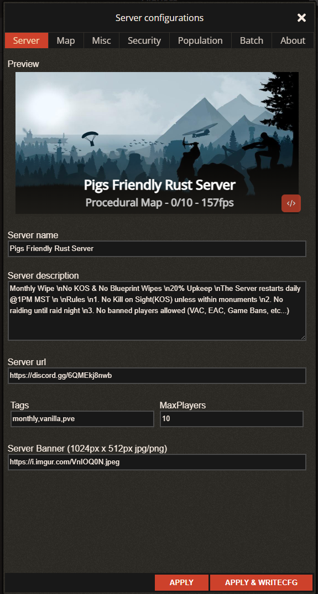
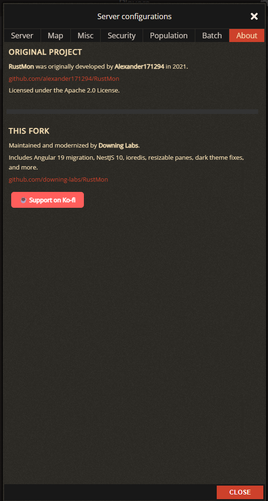
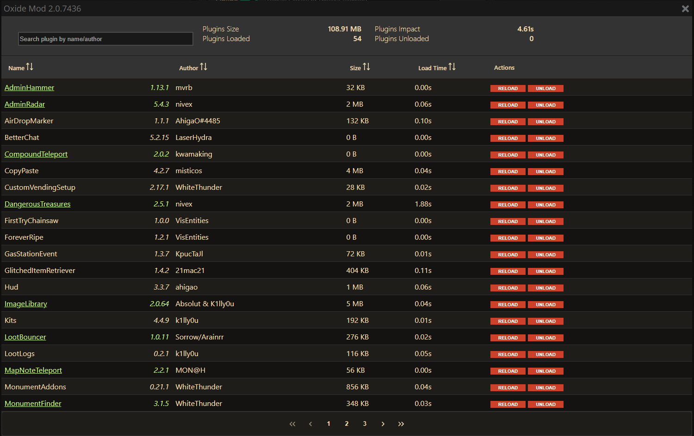
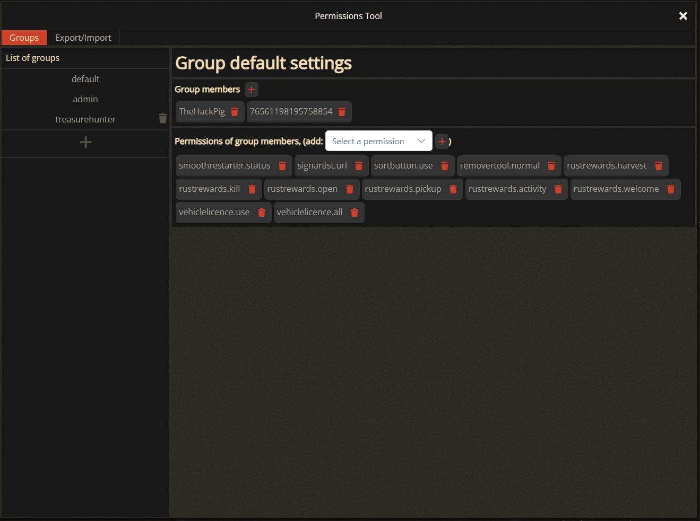

# RustMon v2.0.0

A Rust game server admin panel — forked and modernized by [Downing Labs](https://github.com/downing-labs).

> Originally developed by [Alexander171294](https://github.com/alexander171294/RustMon) in 2021. Licensed under Apache 2.0.

## Features

- Multiple server login with session history
- Single-screen dashboard: Chat, Players, and Console
- Resizable panes — drag the dividers to adjust layout
- Console with word wrap — long log lines no longer break the layout
- Plugin manager with enable/disable/reload and update checker
- Permissions groups with export/import
- Full server configuration panel (settings, map, misc, security, population, batch commands)
- Reboot with timed warning
- Player tools including auto-kick on high ping
- Steam profile integration (requires Steam API key)
- About tab with project credits and Ko-fi support link

## What Changed in This Fork

- **Angular 13 → 19** — full incremental migration through each major version
- **NestJS 8 → 10** — backend framework upgrade
- **Redis client v3 → ioredis v5** — promise-native Redis client
- **PrimeNG 13 → 19** — UI component library upgrade with dark theme
- **Node 14/16 → 20** — updated base Docker images
- **Docker Compose** — added root-level compose file for local and self-hosted deployment
- **Removed Elastic APM** — dead code pointing at original author's private infrastructure
- **Removed hardcoded credentials** — Steam API key and Redis password now come from environment variables
- **Removed Hotjar tracking** — analytics pointing at original author's account
- **Fixed console word wrap** — long log lines no longer expand the pane
- **Added resizable panes** — drag dividers between Chat, Players, and Console
- **Fixed restart button** — prompt was silently failing when using default values
- **Fixed PrimeNG 19 breaking changes** — ToggleSwitch, TooltipModule, theme preset, output path
- **Added About tab** — proper attribution for original author and this fork

## Screenshots

### Login


### Dashboard


### Server Configuration


### About


### Plugin Manager


### Permissions Manager


## Getting Started

### Prerequisites

- Docker and Docker Compose
- A Steam API key (optional, for player profile enrichment)
- A Rust server with RCON enabled

### Quick Start

1. Clone the repo:
```bash
git clone https://github.com/downing-labs/RustMon.git
cd RustMon
```

2. Copy the example env file and fill in your values:
```bash
cp .env.example .env
```

3. Edit `.env`:
```
STEAM_API=your_steam_api_key_here
REDIS_PASSWORD=your_redis_password_here
```

4. Pull and start:
```bash
docker compose up -d
```

5. Open `http://localhost:8080` in your browser and connect to your Rust server via RCON.

### Upgrading

```bash
docker compose down
docker compose pull
docker compose up -d
```

No rebuild required — just pull the latest images from Docker Hub.

### Building Locally

If you want to modify the code and build your own images:

```bash
git clone https://github.com/downing-labs/RustMon.git
cd RustMon
cp .env.example .env
# Edit .env with your values
docker compose build
docker compose up -d
```

To rebuild after making changes:

```bash
docker compose down
docker compose build
docker compose up -d
```

### Getting a Steam API Key

Visit [https://steamcommunity.com/dev/apikey](https://steamcommunity.com/dev/apikey) and register with `localhost` as the domain for self-hosted use.

### Environment Variables

| Variable | Description | Default |
|---|---|---|
| `STEAM_API` | Steam Web API key for player profile lookups | required |
| `REDIS_PASSWORD` | Password for Redis cache | `rustmon` |

## Roadmap

These features exist in the original codebase as stubs or were planned but not completed. They are hidden in this fork until implemented:

- [ ] **Player permissions per user** — assign Oxide permissions directly to individual players (Permissions → Players tab)
- [ ] **Player restrictions** — auto-kick players with private profiles, VAC bans, or excessive ping (Player Tools → Restrictions tab)
- [ ] **In-game bot** — auto-respond to chat commands like `!pop`, `!wipe`, custom responses (Player Tools → In Game BOT tab)
- [ ] **Auto-skip queue** — manage a list of players who automatically bypass the join queue (Player Tools → Auto-skip Queue tab)
- [ ] **Discord bot integration** — bridge chat between Discord and the server, assign groups to Discord users
- [ ] **Console command history** — recall previous commands with the up arrow key
- [ ] **RustMon Blacklist** — shared blacklist of players across RustMon instances

## Support

If this fork has been useful to you, consider supporting development:

☕ [Ko-fi: hackpig1974](https://ko-fi.com/hackpig1974)

## License

Apache 2.0 — see [LICENSE](LICENSE) for details.
